# Pre-Final

### Carlos Andrés Cuéllar Velásquez 2497117
       
## Bitácora

### Problema 1
1.  Class CaesarCipher.

     1.1 Se realizan ambos metodos, tanto para cifrar como para descifrar.

 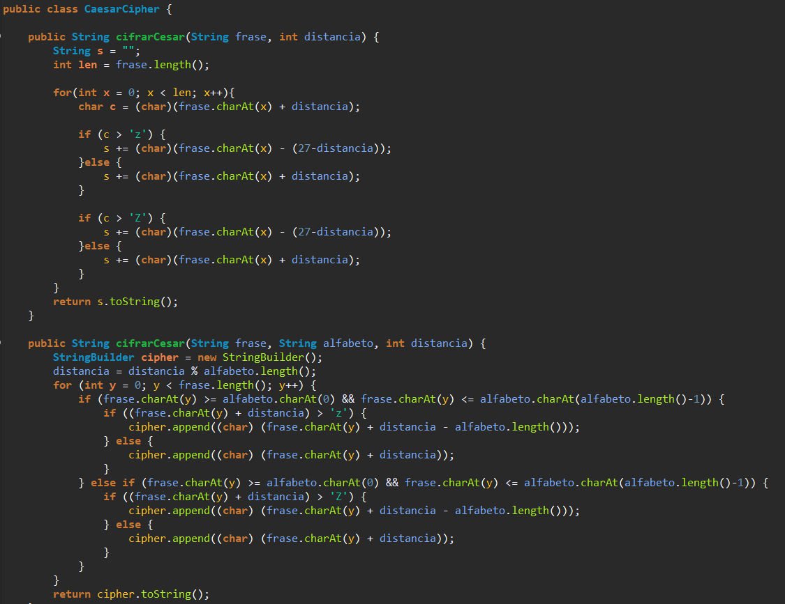

### Problema 2

2.  Class Poligono.

     2.1 Se crea la clase Poligono que sera la interfaz a implementar.

 
 
 3.  Class Triangulo, Cuadrilatero, Pentagono, Hexagono, Octagono.

     3.1 Se crean las clases de las figurar a determinar su area y perimetro.

 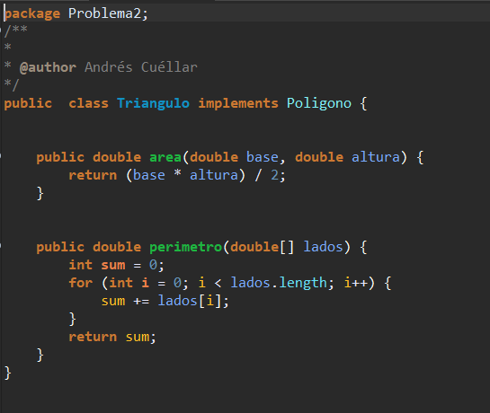
 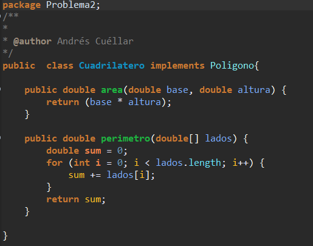
 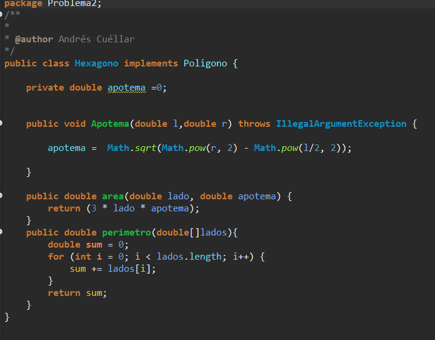
 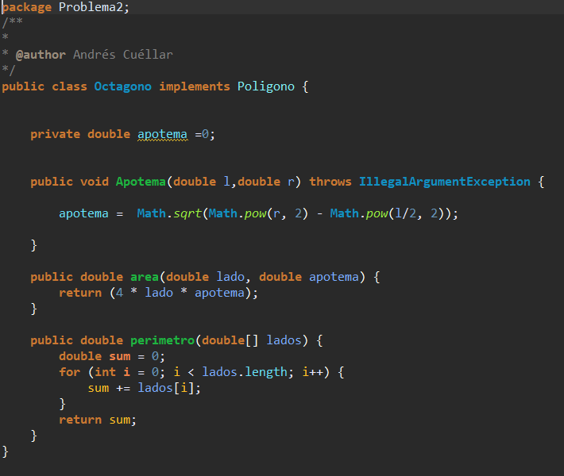
 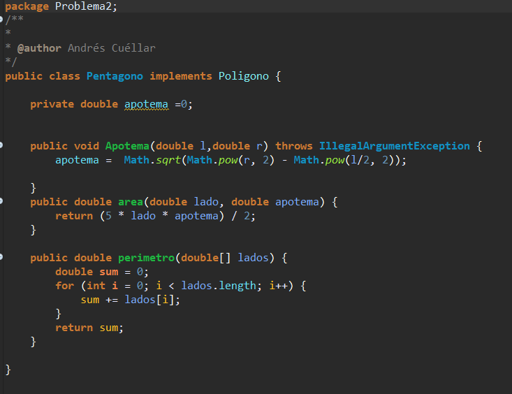
 
  4.  Class TrianguloIsoceles, TrianguloEquilatero, Cuadrado y Rectangulo.

     4.1 Se crea las clases de Triangulo y Cuadrilatero respectivamente. Las cuales heredaran sus metodos.
   
   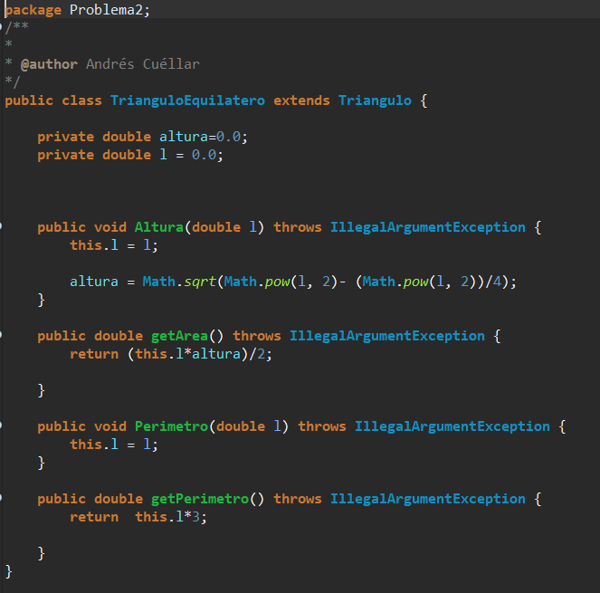
   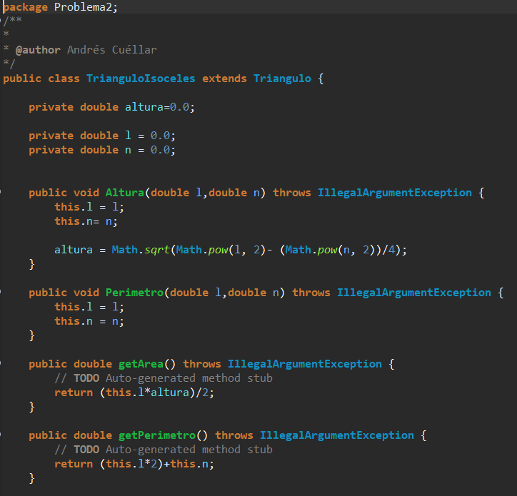
   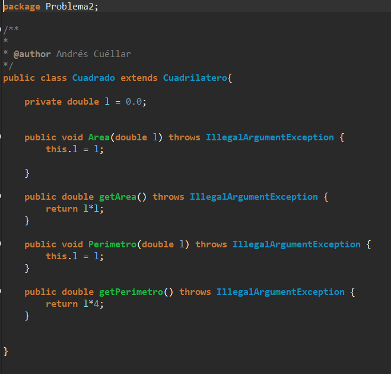
   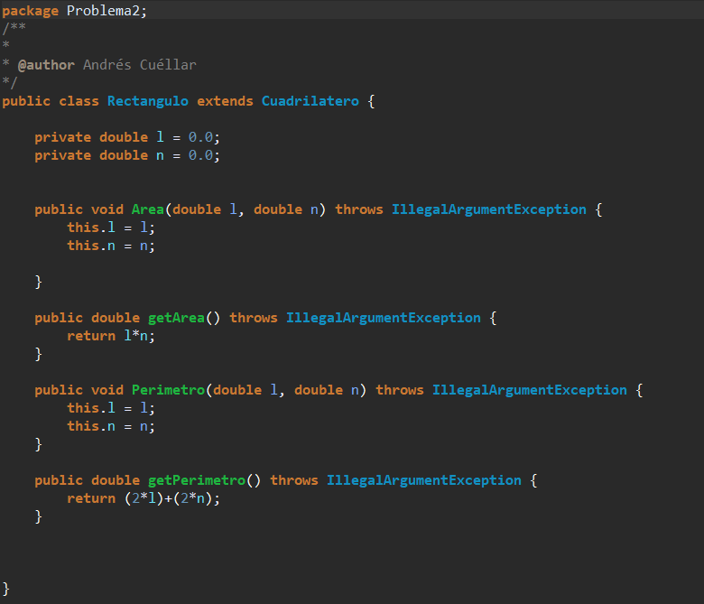
  5.  Class FabricaFiguras.

     5.1 Se crea la clase FabricaFiguras donde se crearan las figuras solicitadas por el usuario.

   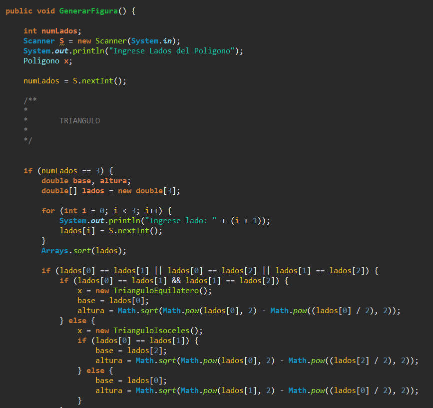
   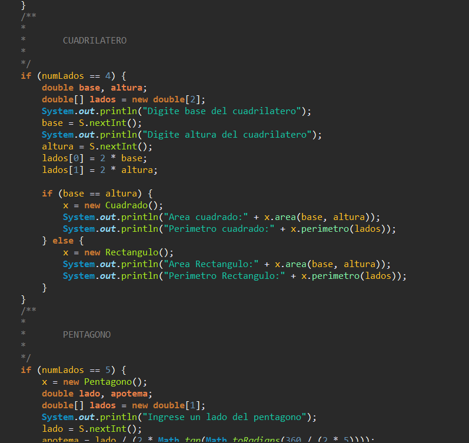
 
 ### Problema 3 
 
  6.  Class Poker.

     6.1 Se crea la clase Poker donde habran set y get del tipo de carta y su valor.
   
   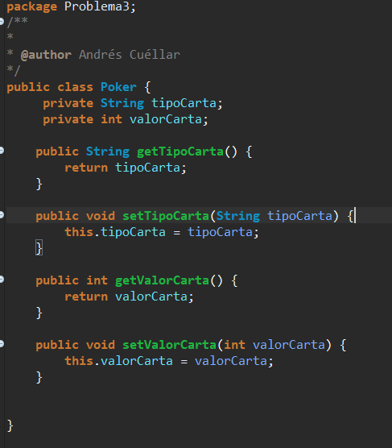

  7.  Class ManoCartas.

     7.1 Se crea la clase ManoCarta donde tendremos los metodos de Agregar carta y Jugar la carta.

   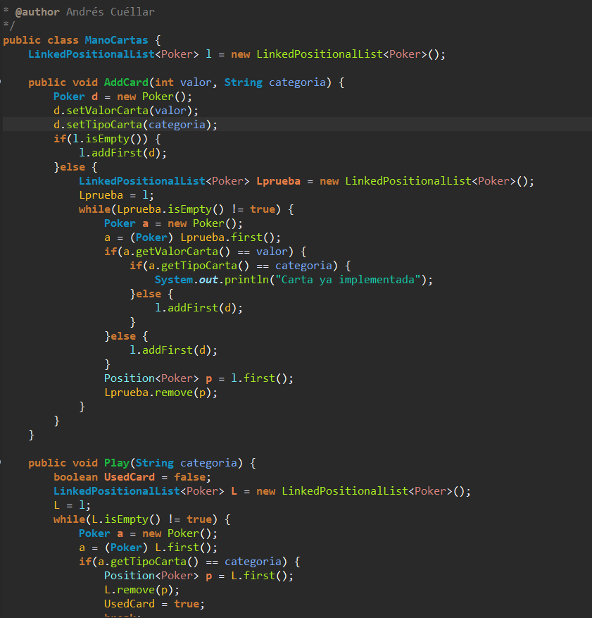
 

